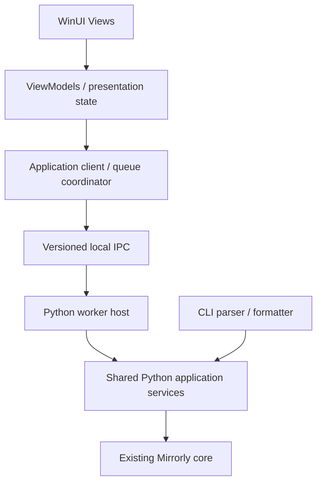

# GUI-ADR-001：WinUI frontend 与独立 Python worker

> 2026-09-19 · 技术路线及产品边界 APPROVED；生命周期细节和目录为 PROPOSED DESIGN。
> 状态与待决事项以 [入口](README.md) 为准。

> **后续实施更新（2026-09-24）**：下文保留 Phase 0 ADR 的历史事实与提案。
> 当前共享 application 服务已由 Phase 2 完成；Phase 3B/3C 只读 worker、生命周期
> gate 与去重契约见 [PRODUCTION_WORKER](PRODUCTION_WORKER.md)。O-07 的 GUI 配置根
> 与 Python/C# 归属已冻结，见 [CONFIGURATION](CONFIGURATION.md)；历史 registry/identity
> 提案不构成新增 task UUID 的授权。后续 Phase 3D 已接入唯一 production mutation
> setup.create，包含 gate admission、显式 approval 和部分副作用事实；仍无 GUI 业务绑定。

## 背景与决定

**CURRENT FACT**：Mirrorly `0.1.0` 是 Python CLI；配置、repo identity、snapshot/manifest、retention、verify、restore 已存在。主要安全编排仍在 [cli.py](../../src/mirrorly/cli.py)，没有 GUI application API、worker 协议、运行进度 observer 或 cooperative cancel token。

**APPROVED**：采用 WinUI 3 / Windows App SDK 的 C#/XAML 桌面前端与独立 Python worker。WinUI 提供 Windows/Fluent 控件、主题及 UI Automation 基础；Python core 保持既有语义。进程隔离让同步文件 IO 不占 UI thread，但增加 IPC、双运行时部署和故障收敛成本，必须显式测试。WPF 仅在真实阻断出现时重新评估，不同时维护第二套 UI。



图为目标结构，当前 CLI 尚未改成图中的形态。GUI 不长期调用 `cli.cmd_*`、构造 argparse Namespace 或解析人类 stdout；CLI JSON 是命令输出兼容契约，不是 GUI 最终 IPC。现有 JSON 只有最终结果，不能表达完整 operation lifecycle；部分失败在 stderr，错误码也不足以区分提交前后。不得复制 `cmd_backup` 形成第二套编排。

## 职责边界

| 层 | 负责 | 不负责 |
| --- | --- | --- |
| View | 布局、焦点、键盘、可访问名称、绑定 | 文件写入、安全判断、排队规则 |
| ViewModel | 用户意图、页面状态、命令可用性、已知错误的人话展示 | 根据颜色/退出码猜快照成功、遍历 IO 阻塞 UI |
| C# application client/coordinator | IPC DTO、内存队列、去重、projection、GUI activity/settings | 仓库身份判定、锁恢复、retention、实际 restore |
| Windows platform services | folder navigation、Explorer、tray、notification、窗口生命周期 | 从用户路径推断可信 repo 或绕过 core 修改快照 |
| Python worker | 协议解析/验证、请求分派、事件封装、流管理 | 另写业务流程、使用 print/input 代替协议 |
| Python application service（未来） | 共享 init/backup/list/verify/restore 编排、结构化结果、授权检查点 | GUI 字体/主题、用户活动历史、CLI 专用文案 |
| Existing core | repo identity、锁、sequence、manifest、publish、hardlink、retention、recovery、restore safety | GUI 队列、toast、view state |

GUI registry 的 `backup_id` 是展示/队列身份；Python 仍用配置与 repo identity 验证实际操作。GUI 判断不能替代 core 验证。锁顺序仍是 task → repo writer；GUI 串行队列不是跨进程锁。

## 当前可复用面与未来提取

| CURRENT FACT | 复用方式/限制 |
| --- | --- |
| [config.py](../../src/mirrorly/config.py) `TaskConfig` / 读写配置 | 一个 source、一个 target；严格 TOML 不接受 GUI 字段；写函数不等于成熟的配置 CRUD service |
| [repo.py](../../src/mirrorly/repo.py) `init_repo` / `load_repo` | 初始化和元数据；GUI 不直接用 `load_repo` 代替 CLI 的 `_resolve_repo` 身份/卷定位流程 |
| `cli._resolve_repo`、锁、`_select_baseline`、`_scan_and_detect`、report | 安全关键编排提取对象；不直接成为承诺稳定的 GUI API |
| [manifest.py](../../src/mirrorly/manifest.py) 清单与选择 helper | snapshot 浏览来自验证后的 manifest；latest 按 sequence，不能按文件名排序猜测；legacy 歧义需显式选择 |
| [snapshot.py](../../src/mirrorly/snapshot.py) `write_snapshot` / `SnapshotResult` | 同步写入与最终统计，无实时进度/取消 |
| [verify.py](../../src/mirrorly/verify.py) `verify_snapshot` / `VerifyReport` | quick/full 与 hash coverage 分别表达；`ok` 不可抹去 unhashed_entries |
| [restore.py](../../src/mirrorly/restore.py) `plan_restore` / `apply_restore` | plan/apply 安全边界保持；多条 literal selector 可用于恢复选择，无 Keep both |

**PROPOSED DESIGN**：未来从 `cli.py` 提取 `src/mirrorly/application/`，由 CLI 与 worker 共用；先建立兼容性测试再逐段移动编排，不在引入 GUI 的同一补丁里重新设计 core。保留 CLI 参数、确认规则、退出码、JSON 字段/输出行为、锁范围及顺序、complete publication、retention、recovery、mandatory reports 与既有测试。CLI formatter 继续适配旧契约，GUI 使用新的 typed result；不为统一 DTO 而更改 CLI JSON。

扩展错误 reason code、progress observer、cancel checkpoint 都须后续单独批准；不能声称仅“提取代码”就自动获得这些能力。

## Desktop 与 worker lifecycle（PROPOSED DESIGN）

- 每个 Windows 用户会话一个 GUI coordinator；重复启动激活已有窗口，避免两个独立内存队列。跨会话/外部 CLI 仍由现有锁裁决。
- Desktop process 同时拥有窗口和 tray；隐藏/最小化只改变可见性，不能 dispose coordinator、IPC 或 worker。
- 按需启动一个受管理的 Python child session，后台读取协议/诊断流；IO/operation runner 与协议读写分离。一次一个 Backup operation；空闲 worker 可关闭并在下次重建 session。
- 使用显式 Python executable、模块、绝对配置目录与受控工作目录；生产包不能依赖用户 PATH/Conda 激活或当前目录猜配置。开发阶段可指向已有环境，最终 Python 打包方式为 O-09（关联总体分发决策 O-06）。
- 完整收到 terminal result 并确认 worker 不再执行该 operation 后才释放 slot。失联/崩溃进入 outcome unknown，停止 dispatch；不能先拉起另一个 worker 又继续队列。
- 父进程异常退出不等于用户 Cancel。失联 worker 如何收尾、是否等待当前 IO/operation 完成是 O-03；不得采用 kill-on-window-close/job-close 作为取消。生产接入前必须解决 orphan 检测与不重复启动规则。
- 真正 Exit 的 Running 部分为 O-01；本轮不承诺后台 broker、重连或跨启动恢复。应用不作为 Windows service，不需要默认提权。

## Python worker 分发与打包（OPEN DECISION O-09）

**CURRENT FACT · 2026-09-20**：Microsoft 的 [single-project MSIX limitations](https://learn.microsoft.com/en-us/windows/apps/windows-app-sdk/single-project-msix#limitations)
明确指出，生成的包只支持一个 executable；需要把多个 executable 放入同一个
MSIX 时，应使用 Windows Application Packaging Project。这是 single-project
打包方式的限制，不能泛化为 MSIX 不能承载多进程应用。

Phase 1A 的包包含 desktop host；它启动的是包外的
`C:\Users\sakur\anaconda3\envs\mirrorly\python.exe`，脚本也在当前 worktree，
不是包内生产 worker。**Phase 1A packaged output PASS ≠ final distribution solved**。
当前证据仅覆盖 packaged WinUI desktop app + 开发机外部 Python worker。

**OPEN DECISION**，不在 Phase 1A closure 拍板或迁移项目：

| 候选 | 需要后续证明的事项 |
| --- | --- |
| A. 保留 MSIX/package identity；使用 Windows Application Packaging Project，或其他经过官方文档与实测支持的多 executable 打包方案 | desktop、Python executable、worker 及其依赖一起部署；包内路径/子进程启动；通知身份；签名、安装、升级、卸载及无 Conda 的干净机器验证。参见 [官方 packaging project 文档](https://learn.microsoft.com/en-us/windows/msix/desktop/desktop-to-uwp-packaging-dot-net) |
| B. unpackaged/self-contained WinUI，配合传统 installer/deployment | .NET/App SDK 与 Python 的具体部署方式；通知/激活所需注册；安装升级与卸载；干净机器验证。参见 [官方分发选项](https://learn.microsoft.com/en-us/windows/apps/package-and-deploy/) |

self-contained 不能被理解为 Python 已自动打包，也不自动带来 package identity。
两候选继续保留同一个独立 Python worker 与 IPC 边界，不为打包而改 core 或把
Python 业务搬进 GUI。当前 single-project 原型结构保持不变。

## Backup / repository（APPROVED）

一个 Backup 只对应一个 source root 和独立 repository。同一盘可以容纳多个 repo；不允许多个 GUI Backup 指向同一 repo 并假装有 task namespace。导入时由 Python 解析/验证 identity，按实际 `repo_id` 检测别名，不靠字符串路径去重。尚未创建的 Backup 在创建时验证最终位置；未知或歧义身份 fail closed。

**CURRENT FACT**：`init_repo(target_root)` 在目标下面创建 `MirrorlyRepo`。创建 UI 必须区分“所选目标父目录”和“最终实际 repository 路径”：

| Backup | Source | 选择的目标父目录 | 实际 repository |
| --- | --- | --- | --- |
| Documents | `C:\Users\…\Documents` | `E:\Mirrorly\Documents` | `E:\Mirrorly\Documents\MirrorlyRepo` |
| Photos | `D:\Photos` | `E:\Mirrorly\Photos` | `E:\Mirrorly\Photos\MirrorlyRepo` |

创建确认页展示最终路径；不得隐式把多份数据混入 `E:\Mirrorly`。名称子目录建议可以由 UI 提供，但必须预览、验证和明确采用，不改变 core 路径语义。两 pane 是单 source/单 destination 的文件夹导航，支持 Back/Up/breadcrumb、粘贴路径、键盘及 inline 错误；Ctrl/Shift 多选用于 Restore 等确实允许多选的场景。

Open in File Explorer 使用服务当前解析的 repo/snapshot 实际路径；盘符变化后重新解析，离线时显示上次路径及检查时间，不打开猜测路径。普通文件可浏览，完整 snapshot 在应用语义上不可编辑，文件系统并未自动设为只读；安静提示“请将文件恢复或复制到其他位置后再编辑，历史版本可能共享文件内容”。

## Restore v1（APPROVED）

流程：Backup → complete Snapshot → 内容 → 恢复位置 → 冲突摘要/确认 → Restore。默认 safe merge；不删除 snapshot 中不存在的目标额外文件。

| GUI 选择 | 现有 Python policy | 边界 |
| --- | --- | --- |
| Skip existing files（默认） | `never` | 已有项跳过；如实展示数量/原因，不承诺比较内容相同 |
| Replace existing files（显式确认） | `always` | 使用 plan 的 overwrite 摘要确认；类型冲突/安全拒绝仍可能无法覆盖 |
| Advanced：仅目标更旧时覆盖（是否暴露为 O-08） | `older` | 按现有时间规则，不代表更“正确”或内容不同 |
| Keep both / 内容相同自动跳过 / 逐文件策略 | 不支持 | DEFERRED，不由 GUI copy/rename 补出行为 |

plan/apply 留在 Python：固定目标、manifest identity/digest、路径校验、reparse 防护、执行前/逐项/提交前复查和不升级动作规则不变。确认绑定 plan identity/内容，plan 变化需要重新审阅；允许的 no-upgrade 降级仍以真实结果展示。恢复到原 source 的 `in_place` 另行明确确认，不能由 Replace 隐式开启。恢复不是事务，已完成写入不自动回滚；restore 不自动 full verify，想先检查必须显式执行真实 verify。

当前 `cmd_restore` 对 skipped/conflicts/errors/leftovers 返回 3，包括正常已有目录等情况；GUI 可解释为“已结束，部分项目跳过”，不能抹去这些事实。技术层保留原结果/兼容退出码，用户层不把预期 Skip 叫作“所有文件恢复成功”。

## 建议目录（PROPOSED DESIGN；本轮不创建）

```text
docs/gui/                         # 本目录：决策与契约
desktop/Mirrorly.Desktop/          # WinUI host、Views、Windows platform adapters
  Views/  ViewModels/  Components/ # 页面只表达状态；必要时再拆无 WinUI 的类库
  Services/                       # queue、IPC client、activity/settings、platform
  Resources/                      # semantic colors、spacing、radius、type
  Assets/Decorations/              # 可替换/隐藏的花草
desktop/Mirrorly.Desktop.Tests/    # presentation/queue/client contract tests
src/mirrorly/application/          # 后续单独提取的共享编排
src/mirrorly/worker/               # 后续协议 host/DTO；不承载第二套 backup
tests/application/                # CLI 等价与 application 集成
tests/worker/                     # framing/identity/results/capabilities
tests/gui_e2e/                    # Windows UI Automation + 隔离数据
```

无需首版就创建全部目录或一层一个项目。资源/组件和 coordinator 各有明确 owner；不引入 universal event bus、generic workflow engine 或插件系统。
